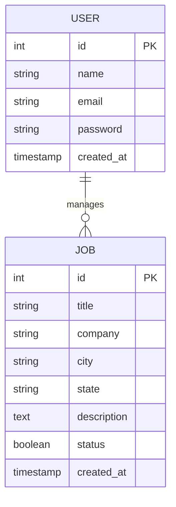

# Job Posting Platform - Frontend

A modern Vue.js 3 frontend application for a job posting platform with authentication, job search, and admin management capabilities.

## 🏗️ Architecture & Design

### Technology Stack
- **Frontend Framework**: Vue.js 3 with Composition API
- **Build Tool**: Vite
- **State Management**: Pinia
- **UI Components**: shadcn-vue (based on Radix Vue)
- **Styling**: Tailwind CSS
- **HTTP Client**: Axios
- **Routing**: Vue Router 4
- **TypeScript**: Full type safety

### System Architecture
```
┌─────────────────┐    ┌─────────────────┐    ┌─────────────────┐
│   Vue.js App    │    │  API Gateway    │    │  Backend        │
│   (Port 5173)   │◄──►│  (Port 8080)    │◄──►│  Services       │
│                 │    │                 │    │  (Port 8081)    │
└─────────────────┘    └─────────────────┘    └─────────────────┘
```

### Design Decisions & Assumptions

1. **Component Architecture**: Modular design with reusable UI components using shadcn-vue
2. **State Management**: Centralized state with Pinia stores for auth and jobs
3. **API Integration**: RESTful API communication through an API gateway
4. **Responsive Design**: Mobile-first approach with Tailwind CSS
5. **Type Safety**: Full TypeScript implementation for better development experience
6. **Error Handling**: Comprehensive error handling with user-friendly messages
7. **Loading States**: Loading indicators for better UX during API calls

## 📊 Data Models

### Entity Relationship Diagram



### Data Models

#### User Model
```typescript
interface User {
  id: number
  name: string
  email: string
  // password is handled server-side
}
```

#### Job Model
```typescript
interface Job {
  id: number
  title: string
  company: string
  city: string
  state: string
  description: string
  status: boolean
  created_at: number // Unix timestamp
}
```

#### API Request Models
```typescript
interface CreateJobRequest {
  title: string
  company: string
  city: string
  state: string
  description: string
}

interface UpdateJobRequest {
  title?: string
  company?: string
  city?: string
  state?: string
  description?: string
  status?: boolean
}
```

## 🚀 Features

### Authentication
- User registration and login
- JWT token-based authentication
- Protected routes
- User session management
- Logout functionality

### Job Management
- **Public Features**:
  - Job search with filters (country, city, district, work type)
  - Job listing with pagination
  - Job detail view
  - Responsive job cards

- **Admin Features**:
  - Create new job postings
  - Edit existing jobs
  - Delete jobs
  - View all jobs with status

### UI/UX Features
- Modern, responsive design
- Loading states and error handling
- Form validation
- Confirmation dialogs
- Professional styling with shadcn-vue components

## 📁 Project Structure

```
src/
├── components/          # Reusable UI components
│   ├── ui/             # shadcn-vue components
│   ├── HeaderComponent.vue
│   ├── LoginForm.vue
│   ├── RegisterForm.vue
│   └── FeaturedJobs.vue
├── views/              # Page components
│   ├── HomepageView.vue
│   ├── LoginView.vue
│   ├── RegisterView.vue
│   ├── JobSearchView.vue
│   ├── JobDetailView.vue
│   ├── AdminView.vue
│   └── ProfileView.vue
├── stores/             # Pinia stores
│   ├── auth.ts         # Authentication state
│   └── jobs.ts         # Jobs state and API calls
├── router/             # Vue Router configuration
│   └── index.ts
├── lib/                # Utility functions
│   └── utils.ts
└── assets/             # Static assets
    └── main.css
```

## 🛠️ Setup & Installation

### Prerequisites
- Node.js 18+ 
- npm or yarn
- Backend services running (API Gateway on port 8080, Auth Service on port 8081)

### Installation

1. **Clone the repository**
   ```bash
   git clone https://github.com/AtaAksoy/se4458-client
   cd se4458-client
   ```

2. **Install dependencies**
   ```bash
   npm install
   ```

3. **Start development server**
   ```bash
   npm run dev
   ```

4. **Build for production**
   ```bash
   npm run build
   ```

### Environment Configuration

The application expects the following backend services:
- **API Gateway**: `http://localhost:8080`
- **Auth Service**: `http://localhost:8081`

## 🔧 API Integration

### Authentication Endpoints
- `POST /auth/register` - User registration
- `POST /auth/login` - User login

### Job Endpoints
- `GET /jobs/api/v1/jobs` - List jobs with pagination
- `GET /jobs/api/v1/jobs/search` - Search jobs
- `GET /jobs/api/v1/jobs/{id}` - Get job by ID
- `POST /jobs/api/v1/jobs` - Create new job
- `PUT /jobs/api/v1/jobs/{id}` - Update job
- `DELETE /jobs/api/v1/jobs/{id}` - Delete job

## 🐳 Docker Deployment

### Build Docker Image
```bash
docker build -t job-posting-frontend .
```

### Run Container
```bash
docker run -p 5173:5173 job-posting-frontend
```

## 🧪 Testing

### Manual Testing Checklist
- [ ] User registration and login
- [ ] Job search functionality
- [ ] Job detail view
- [ ] Admin job management (CRUD operations)
- [ ] Responsive design on different screen sizes
- [ ] Error handling and loading states
- [ ] Navigation and routing

## 📝 Development Notes

### Key Implementation Details

1. **Authentication Flow**:
   - JWT tokens stored in localStorage
   - Automatic token inclusion in API requests
   - Route guards for protected pages

2. **Job Search**:
   - Real-time search with debouncing
   - Multiple filter options
   - Pagination support

3. **Admin Panel**:
   - Full CRUD operations
   - Form validation
   - Confirmation dialogs for destructive actions

4. **Error Handling**:
   - Centralized error management in stores
   - User-friendly error messages
   - Graceful fallbacks

## 🔮 Future Enhancements

- [ ] Unit and integration tests
- [ ] Advanced search filters
- [ ] Job application system
- [ ] Email notifications
- [ ] Admin dashboard analytics
- [ ] Multi-language support
- [ ] PWA capabilities

## 📄 License

This project is part of the SE4458 course assignment.

**Note**: This frontend application is designed to work with a microservices backend architecture. Ensure all backend services are running before testing the application.
